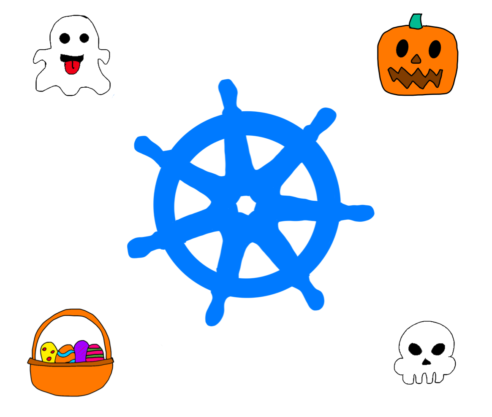

# `kubectl-season` - kubectl plugin seasonal mode

[](http://twitter.com/scraly)
[](https://github.com/scraly/kubectl-season/releases)

<p align="center">
    
</p>

## General

`season` is a kubectl plugin that add a random seasonal (halloween, christmas, easter...) emoji before your Kubernetes resources.
It is written in BASH.

## Install

### Krew

This plugin is available through [krew](https://krew.dev).

1. [Install Krew](https://github.com/GoogleContainerTools/krew) plugin manager for kubectl.
2. Add scraly's custom index `kubectl krew index add scraly https://github.com/scraly/krew-index`
3. Install the plugin `kubectl krew install scraly/season`
4. Run `kubectl season`
5. Update plugin with `kubectl krew upgrade scraly/season`

### Binary

You can find the latest binaries in the [releases](https://github.com/scraly/kubectl-season/releases) section.  
To install it, place it somewhere in your `$PATH` for `kubectl` to pick it up.

**Note**: If you build from source or download the binary, you'll have to change the name of the binary to `kubectl-season` (`-` to `_` in `season`)
due to the enforced naming convention for plugins by `kubectl`. More on this [here](https://kubernetes.io/docs/tasks/extend-kubectl/kubectl-plugins/#naming-a-plugin).

## Usage

`kubectl season <resource_type>`

```
$ kubectl season deploy                                                                                                                        
   NAME       READY   UP-TO-DATE   AVAILABLE   AGE
🧟 httpbin    1/1     1            1           26h
🧟 my-nginx   3/3     3            3           44h
🧟 traefik    3/3     3            3           6d
```

```
$ kubectl season po, deploy 
   NAME                            READY   STATUS    RESTARTS   AGE
🎃 pod/httpbin-c9cb9cbf6-r2gnc     1/1     Running   0          2d2h
🎃 pod/my-nginx-75897978cd-f28j9   1/1     Running   0          2d21h
🎃 pod/my-nginx-75897978cd-pt2dx   1/1     Running   0          44h
🎃 pod/my-nginx-75897978cd-w2bcg   1/1     Running   0          43h
🎃 pod/traefik-85854f965f-pb6j2    1/1     Running   1          174m

   NAME                       READY   UP-TO-DATE   AVAILABLE   AGE
🎃 deployment.apps/httpbin    1/1     1            1           2d2h
🎃 deployment.apps/my-nginx   3/3     3            3           2d21h
🎃 deployment.apps/traefik    1/1     1            1           7d
```

## Release

1. Tag with a new version


```
git tag v0.0.5
git push --tags
```

2. GitHub will create assets in .zip and .tar.gz

3. Display the sha256 checksum

Download the tar.gz and then execute the following command:

```
sha256sum kubectl-season-0.0.5.tar.gz
```

4. Edit `krew.yml` file with the new version and the sha256

5. Push it into https://github.com/scraly/krew-index/blob/main/plugins/season.yaml

## Changelog

See the [CHANGELOG](CHANGELOG.md) file for details.
